

  

# My Prayer

  
This is an application to display the Quran, prayer times and remembrances

  
   
  
  

  
  # Downloads
   
  
  
  
  
  ## Holy Quran 
  * Bookmark
  * Content
  * SealPrayer
  * Pages
  
  ## Ayahs 
  * View separate verses 
  * Search for verses 
  * Add to favorites 
  * Bookmark 
  * Share with friends.
  
  ## Azkar 
  * Display categorized remembrances
  * Calculate the number of repetitions
  * Add to favorites
  * Share with friends
  
  ## TimePrayer 
  * View prayer times throughout the month
  * Display of upcoming prayers and the time remaining for them
  
  ## Listen Quran  
  * Listening to the Quran
  * Reader's Choice
  
  ## Screenshot
  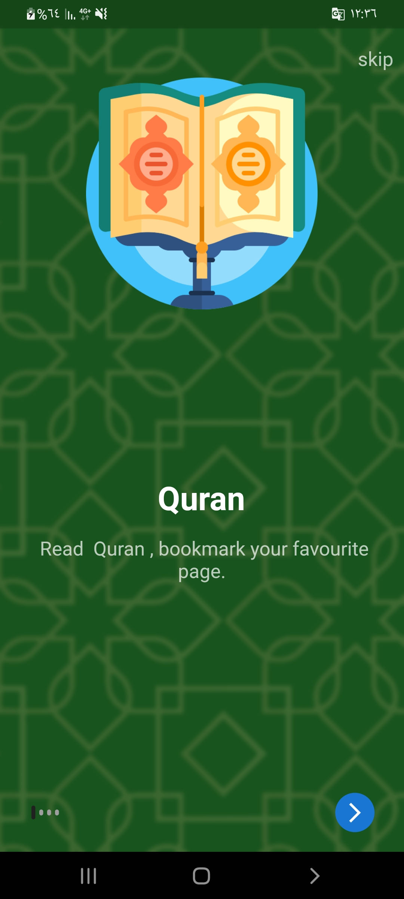 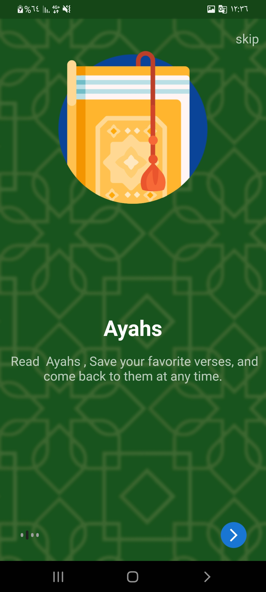
  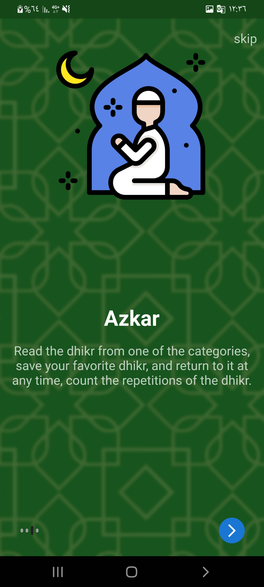 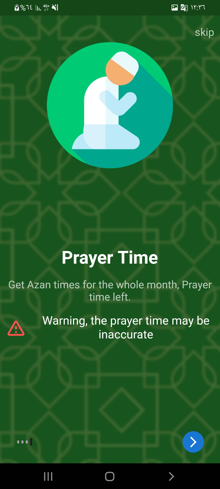
  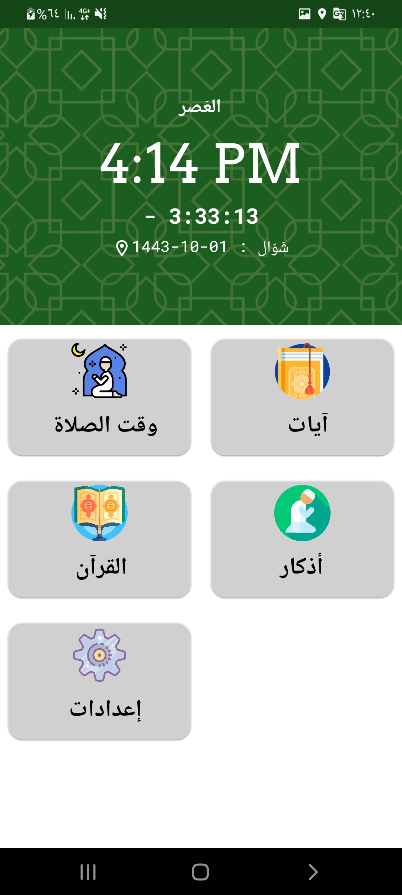 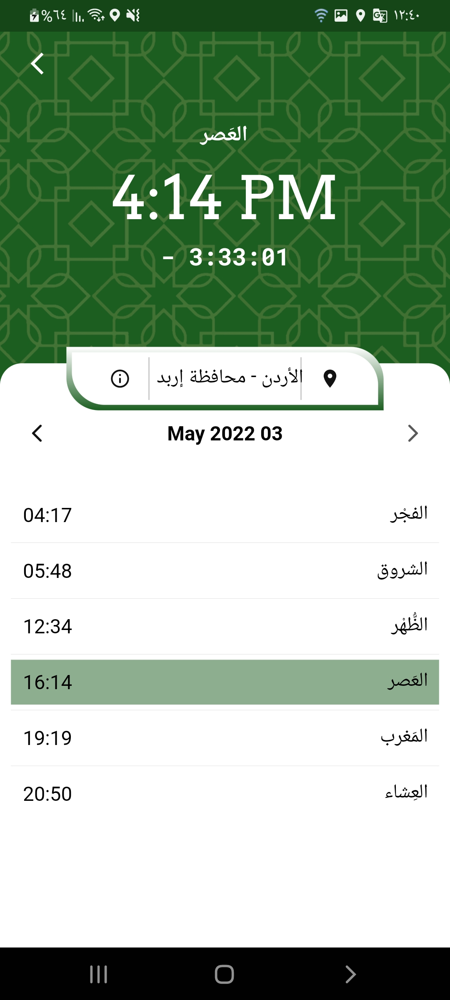
   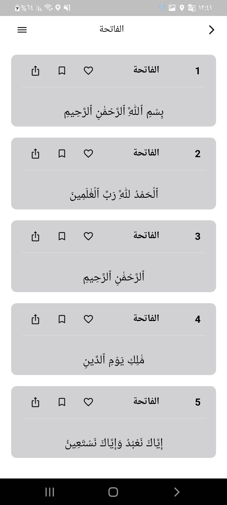
  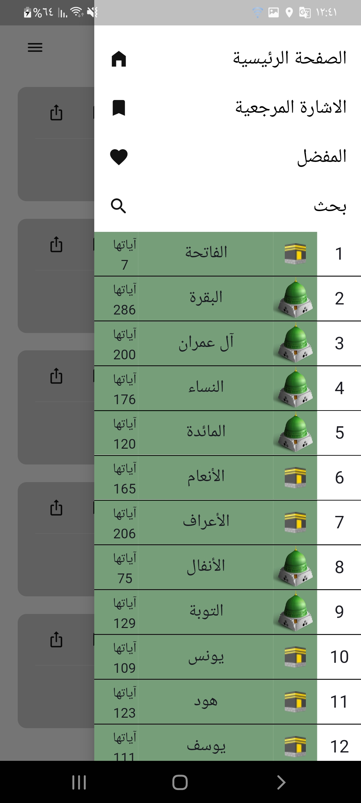 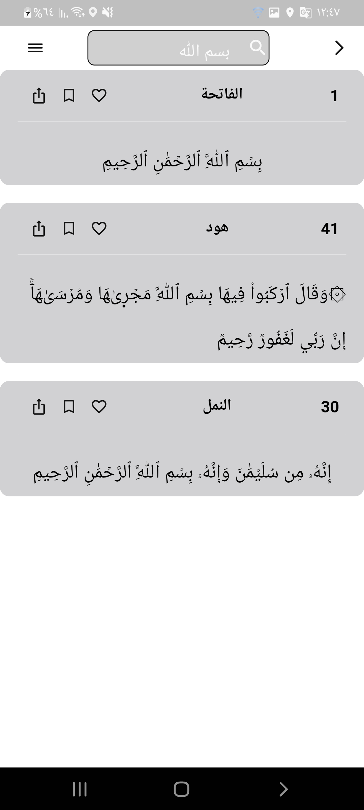
  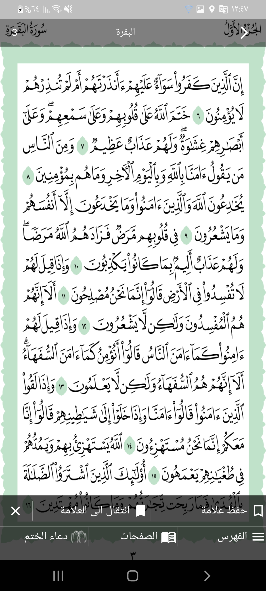 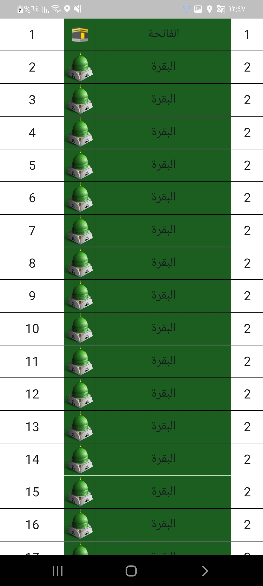
  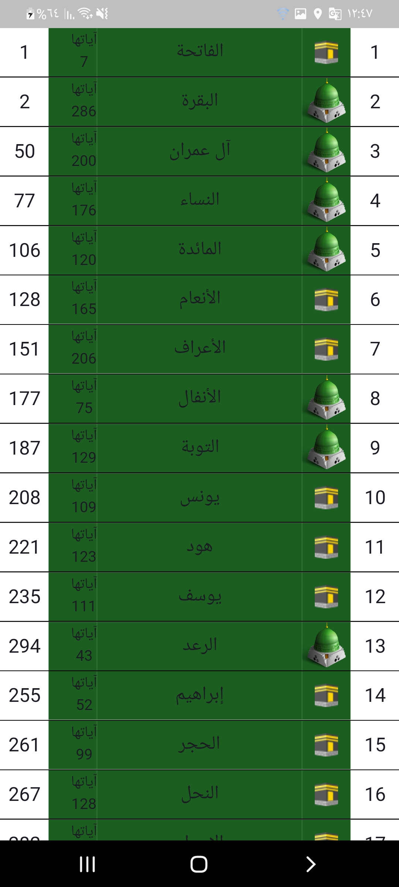 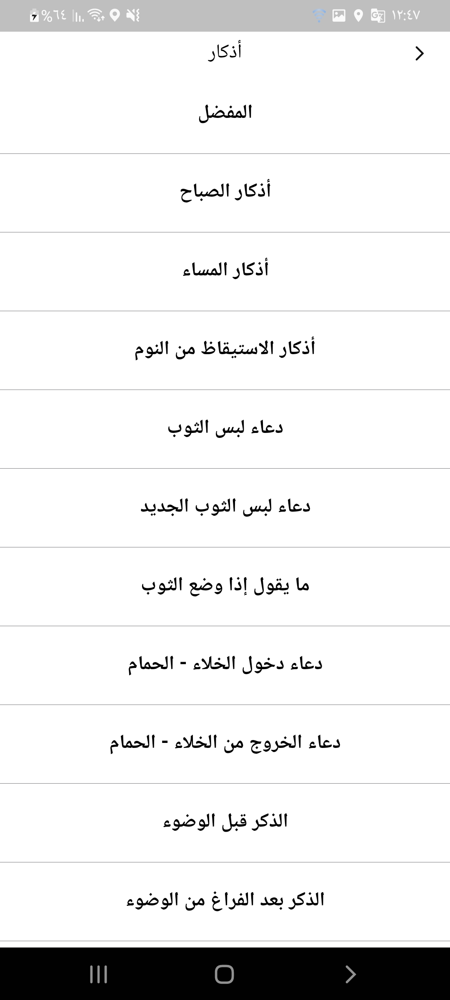
  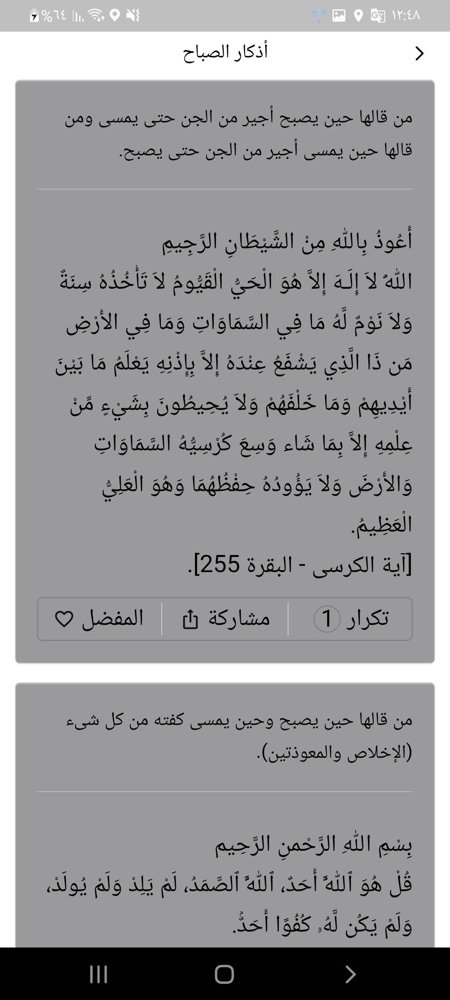 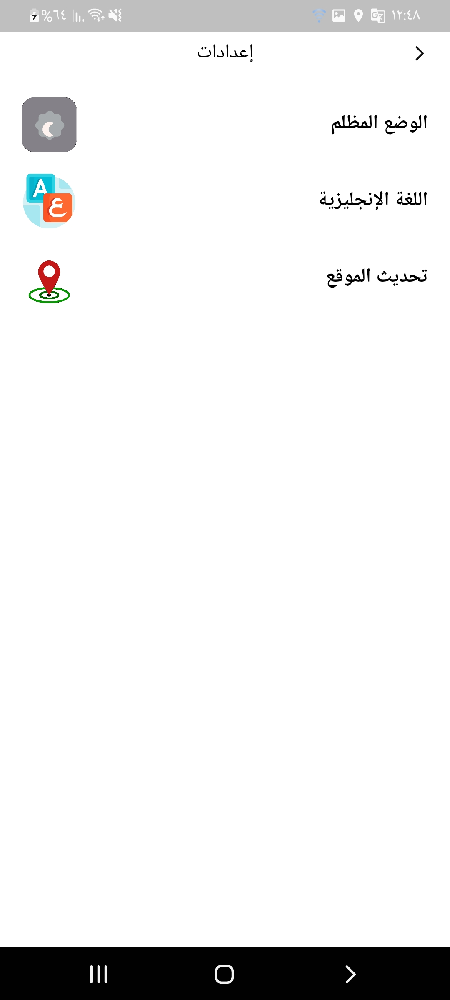
  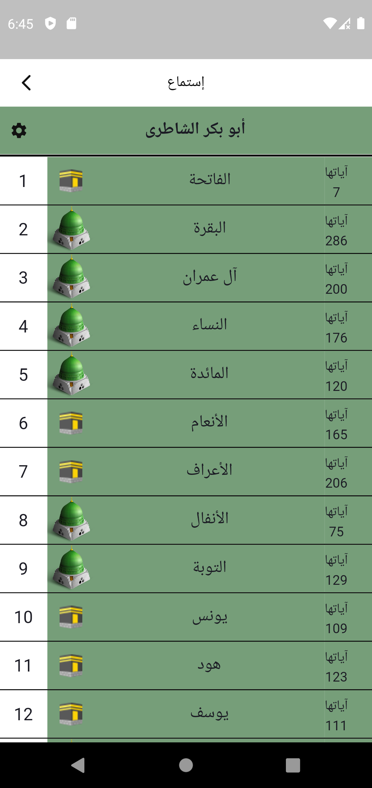 
  
  #
  ## Sorurces
  * time prayer api: http://api.aladhan.com/v1/calendarByCity
  * quran image: https://github.com/maknon/Quran
  * quran json : https://raw.githubusercontent.com/risan/quran-json/main/dist/quran.json
  * The Noble Quran is written without formation: http://www.islih.com/view/7505
  * azkar json: https://github.com/osamayy/azkar-db/blob/master/azkar.json
  * Listen Quran API: https://quran.api-docs.io/v4/getting-started/introduction
  
